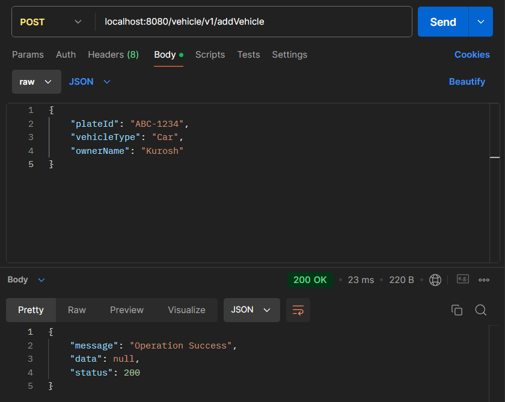

# SmartPark
"SmartPark" is a technology company developing an intelligent parking management system for urban areas. The company is aiming to optimize the use of parking spaces and facilitate easy navigation for drivers.

The service should be capable of doing,

• Registering a parking lot

• Registering a vehicle

• Checking in a vehicle to a parking lot

• Checking out a vehicle from a parking lot

• Viewing current occupancy and availability of a parking lot

• Viewing all vehicles currently parked in a lot

BUILD INSTRUCTIONS \
JRE : 1.8 \
run (localhost:8080) org.smartparking.SmartParkingApplication \
H2 : jdbc:h2:mem:smartPark \
 \

==================================================================================

# Registering a parking lot

lotId: Required / 50 characters max

location: Required / 100 characters max

capacity: Required

----------------------------------------------------------------
curl --location 'localhost:8080/parkingLot/v1/addParkingLot' \
--header 'Content-Type: application/json' \
--data '{
"lotId": "M-1234",
"location": "Mall;",
"capacity": 1
}'
----------------------------------------------------------------
Request body sample:

{
"lotId": "M-1234",
"location": "Mall;",
"capacity": 1
}
----------------------------------------------------------------

==================================================================================

# Registering a vehicle

plateId: Required / 20 characters max

ownerName: Required / 50 characters max

vehicleType: Required / select specific type obtain from /v1/getVehicleTypeMap response data

----------------------------------------------------------------
curl --location 'localhost:8080/vehicle/v1/addVehicle' \
--header 'Content-Type: application/json' \
--data '{
"plateId": "ABC-1234",
"vehicleType": "Car",
"ownerName": "Kurosh"
}'
----------------------------------------------------------------
Request body sample:

{
"plateId": "ABC-1234",
"vehicleType": "Car",
"ownerName": "Kurosh"
}
----------------------------------------------------------------

==================================================================================

# Checking in a vehicle to a parking lot

plateId: Required

lotId: Required

----------------------------------------------------------------
curl --location 'localhost:8080/vehicle/v1/checkInVehicle' \
--header 'Content-Type: application/json' \
--data '{
"plateId": "ABC-1234",
"lotId": "M-1234"
}'
----------------------------------------------------------------
Request body sample:

{
"plateId": "ABC-1234",
"lotId": "M-1234"
}
----------------------------------------------------------------

==================================================================================

# Checking out a vehicle from a parking lot

plateId: Required

----------------------------------------------------------------
curl --location 'localhost:8080/vehicle/v1/checkOutVehicle' \
--header 'Content-Type: application/json' \
--data '{
"plateId": "ABC-1234"
}'
----------------------------------------------------------------
Request body sample:

{
"plateId": "ABC-1234"
}
----------------------------------------------------------------

==================================================================================

# Viewing current occupancy and availability of a parking lot

lotId: Optional 

location: Optional

isFull: Optional value: True, False

----------------------------------------------------------------
curl --location --request GET 'localhost:8080/parkingLot/v1/getParkingLotList' \
--header 'Content-Type: application/json' \
--data '{
"lotId": "",
"location": "",
"isFull": ""
}'
----------------------------------------------------------------
Request body sample:

{
"lotId": "",
"location": "",
"isFull": ""
}
----------------------------------------------------------------
Response body sample:

{
"message": "Operation Success",
"data": [
{
"createdBy": "system",
"updatedBy": "system",
"createdAt": "2024-10-12T13:06:45.806448",
"updatedAt": "2024-10-12T13:06:45.806448",
"lotId": "H-0123",
"location": "Hospital;",
"capacity": 5,
"occupied": 0
},
{
"createdBy": "system",
"updatedBy": "system",
"createdAt": "2024-10-12T12:53:47.905084",
"updatedAt": "2024-10-12T13:01:04.221357",
"lotId": "M-1234",
"location": "Mall;",
"capacity": 1,
"occupied": 0
}
],
"status": 200
}
----------------------------------------------------------------

==================================================================================

# Viewing all vehicles currently parked in a lot

lotId: Optional (Get all vehicles that are parked when not filled)

ownerName: Optional

plateId: Optional

vehicleType: Optional

----------------------------------------------------------------
curl --location --request GET 'localhost:8080/vehicle/v1/getParkedVehicleList' \
--header 'Content-Type: application/json' \
--data '{
"lotId": "",
"ownerName": "",
"plateId": "",
"vehicleType": ""
}'
----------------------------------------------------------------
Request body sample:

{
"lotId": "",
"ownerName": "",
"plateId": "",
"vehicleType": ""
}
----------------------------------------------------------------
Response body sample:

{
"message": "Operation Success",
"data": [
{
"createdBy": "system",
"updatedBy": "system",
"createdAt": "2024-10-12T12:55:21.113078",
"updatedAt": "2024-10-12T13:09:50.312989",
"plateId": "ABC-1234",
"ownerName": "Kurosh",
"vehicleType": "Car",
"lotId": "M-1234"
}
],
"status": 200
}
----------------------------------------------------------------

